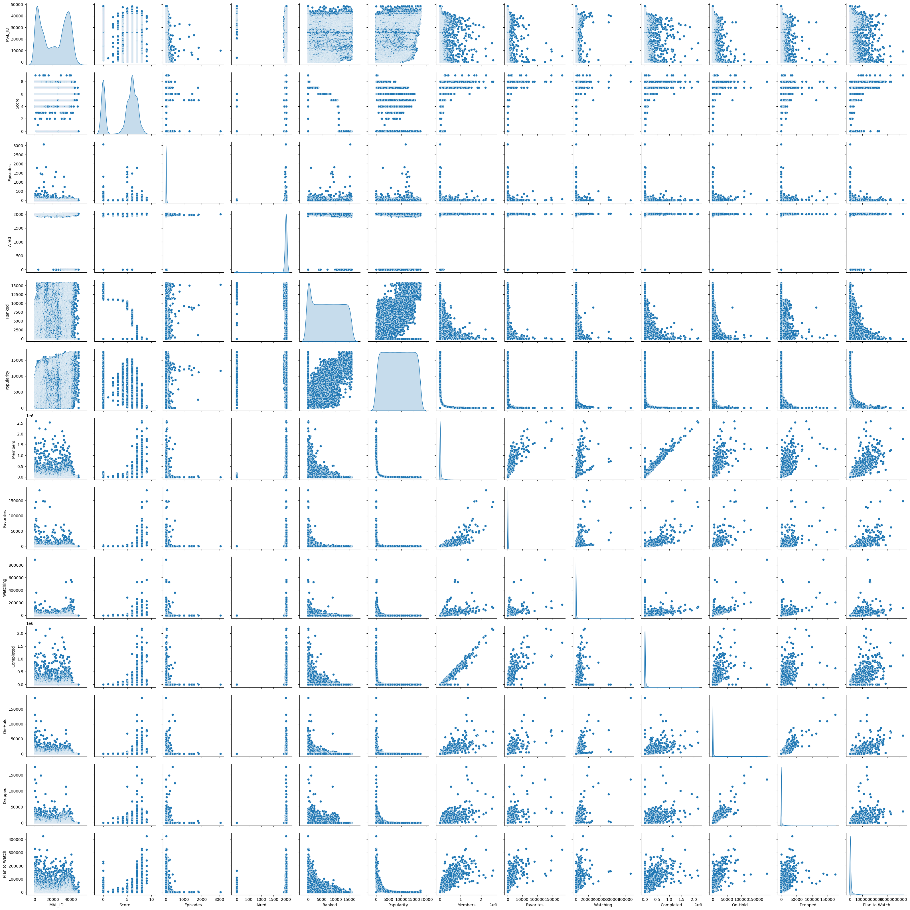
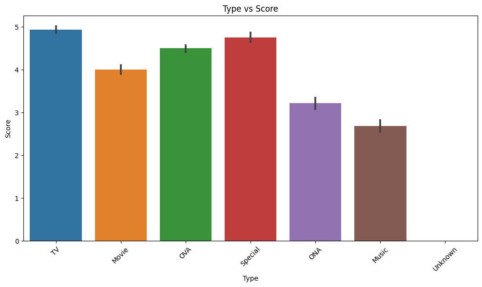
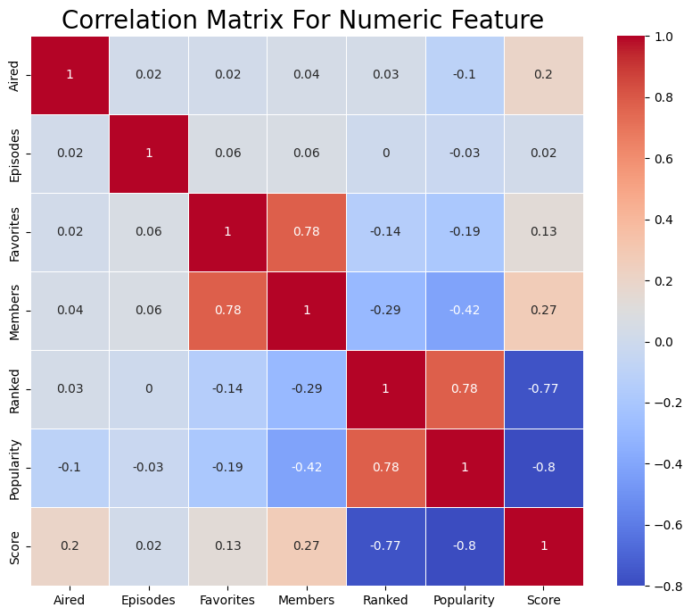

# Laporan Proyek Machine Learning - Elvaret

## Project Overview

Anime adalah genre hiburan yang berkembang pesat dengan ribuan judul yang dirilis setiap tahun. Sementara banyak penggemar anime menghargai keragaman ini, pemilihan anime yang tepat untuk ditonton dapat menjadi tugas yang menantang. Dengan begitu banyak pilihan yang tersedia, seringkali sulit bagi pengguna untuk menemukan anime yang sesuai dengan minat dan preferensi mereka [1].

Sistem rekomendasi anime berbasis machine learning dapat menjadi solusi yang efektif untuk masalah ini. Dengan menganalisis data dari berbagai anime, seperti genre, sinopsis, peringkat, dan fitur lainnya, sistem ini dapat memberikan rekomendasi yang lebih personal dan relevan kepada pengguna [2]. Ini akan membantu pengguna mengeksplorasi anime baru yang mungkin mereka nikmati, serta mengurangi waktu yang diperlukan untuk mencari anime yang sesuai.

Proyek ini bertujuan untuk mengembangkan sistem rekomendasi anime berbasis machine learning dengan memanfaatkan dataset anime yang tersedia. Anime adalah bentuk hiburan yang sangat populer, dan banyak orang memiliki preferensi yang beragam terkait dengan anime yang mereka nikmati. Sistem rekomendasi ini akan membantu pengguna menemukan anime yang sesuai dengan preferensi mereka.

## Business Understanding

#### 1). Problem Statements
- Bagaimana cara membangun sistem rekomendasi yang dipersonalisasi berdasarkan data genre dari dataset anime?
- Bagaimana meningkatkan pengalaman pengguna dalam menemukan anime yang sesuai dengan preferensi mereka?
- Bagaimana mengurangi waktu yang diperlukan pengguna untuk mencari anime yang sesuai dengan minat mereka?

#### 2). Goals

- Mengembangkan model content-based filtering yang dapat memberikan rekomendasi anime berdasarkan genre yang disukai oleh pengguna.
- Menghasilkan sejumlah rekomendasi anime yang sesuai dengan preferensi user dan belum pernah ditonton sebelumnya dengan teknik collaborative filtering.
- Memungkinkan pengguna untuk menyesuaikan preferensi mereka sehingga rekomendasi menjadi lebih personal.

#### 3). Solution Approach
- **Content Based Filtering**
*Content-based filtering* adalah salah satu metode dalam sistem rekomendasi yang digunakan untuk memberikan rekomendasi kepada pengguna berdasarkan karakteristik atau konten dari item atau objek. Metode ini memeriksa atribut-atribut atau karakteristik dari item-item tersebut dan mencoba mencari kesamaan atau korelasi antara item dengan item lainnya berdasarkan atribut-atribut ini. 

- **Collaborative Filtering** 
*Collaborative filtering* adalah metode yang digunakan dalam sistem rekomendasi untuk memberikan rekomendasi kepada pengguna berdasarkan perilaku dan preferensi pengguna lainnya. Metode ini mengasumsikan bahwa pengguna yang memiliki preferensi atau perilaku serupa dalam interaksi dengan item-item akan memiliki preferensi yang mirip dalam item-item yang lainnya.

## Data Understanding
Database MyAnimeList tahun 2020 merupakan kumpulan data yang berisi informasi tentang lebih dari 17.562 anime dan preferensi dari lebih dari 325.772 pengguna yang berbeda di situs myanimelist.net. Dataset ini mencakup daftar anime yang dimiliki oleh setiap pengguna, termasuk daftar anime yang sudah ditonton, rencana untuk ditonton, sedang menonton, atau ditunda. Selain itu, dataset ini juga mencatat penilaian yang diberikan oleh pengguna kepada anime yang telah mereka tonton secara lengkap. Data tersebut juga mencakup informasi terkait anime seperti genre, statistik, studio, dan lain sebagainya. Selain itu, tersedia juga data HTML yang berisi informasi tentang anime, seperti ulasan, sinopsis, informasi tentang staf produksi, statistik anime, genre, dan lainnya yang dapat digunakan untuk keperluan pengambilan data (data scraping).
 
 Dataset: [Kaggle Dataset](https://www.kaggle.com/datasets/hernan4444/anime-recommendation-database-2020).

### Variabel-variabel pada Anime Recommendation Database 2020 dataset adalah sebagai berikut:
1). anime_csv dataset
- MAL_ID: ID MyAnimeList anime ini. 
- Name: Nama lengkap dari anime ini. 
- Score: Nilai rata-rata anime yang diberikan oleh semua pengguna dalam database MyAnimeList. 
- Genres: Daftar genre anime yang dipisahkan oleh koma. 
- English name: Nama lengkap dalam bahasa Inggris dari anime ini. 
- Japanese name: Nama lengkap dalam bahasa Jepang dari anime ini. 
- Type: Jenis anime (TV, film, OVA, dll.). 
- Episodes: Jumlah episode anime ini. 
- Aired: Tanggal tayang anime ini. 
- Premiered: Musim perdana anime ini. 
- Producers: Daftar produser yang dipisahkan oleh koma. 
- Licensors: Daftar pemegang lisensi yang dipisahkan oleh koma. 
- Studios: Daftar studio yang dipisahkan oleh koma. 
= Source: Sumber anime (Manga, Light Novel, Buku, dll.). 
- Duration: Durasi anime per episode 
- Rating: Usia yang direkomendasikan 
- Ranked: Posisi berdasarkan peringkat. 
- Popularity: Posisi berdasarkan jumlah pengguna yang menambahkan - anime ini ke daftar mereka. 
- Members: Jumlah anggota komunitas yang ada dalam "kelompok" anime ini. 
- Favorites: Jumlah pengguna yang memiliki anime ini sebagai "favorit". 
- Watching: Jumlah pengguna yang sedang menonton anime ini. 
- Completed: Jumlah pengguna yang telah menyelesaikan anime ini. 
- On-Hold: Jumlah pengguna yang memiliki anime ini dalam status "Tertunda". 
- Dropped: Jumlah pengguna yang telah meninggalkan anime ini. 
- Plan to Watch: Jumlah pengguna yang berencana menonton anime ini. 

2). rating_complete.csv
- user_id: ID pengguna yang dihasilkan secara acak
- anime_id: ID MyAnimeList dari anime yang telah dinilai oleh pengguna.
- rating: Nilai yang diberikan oleh pengguna untuk anime tersebut.

3). anime_list
- user_id: ID pengguna yang dihasilkan secara acak.
- anime_id: ID MyAnimeList dari anime. .
- score: Nilai antara 1 hingga 10 yang diberikan oleh pengguna. 0 jika pengguna tidak memberikan nilai. 
- watching_status: ID status dari anime ini dalam daftar anime pengguna. 
- watched_episodes: Jumlah episode yang telah ditonton oleh pengguna. 

4). anime_with_synopsis
- MAL_ID: ID MyAnimeList (MAL) adalah identifikasi unik untuk anime tertentu di MyAnimeList.
- Name: Nama anime, yaitu judul lengkap dari anime tersebut.
- Score: Nilai rata-rata yang diberikan oleh pengguna MyAnimeList untuk anime ini. Sebuah indikator seberapa baik atau populer anime ini di komunitas MyAnimeList.
- Genres: Genre-genre yang dimiliki oleh anime ini, yang dipisahkan oleh koma. Genre adalah kategori atau jenis cerita yang dapat mencakup berbagai tema atau elemen dalam anime.
- Synopsis: Sinopsis anime yang memberikan gambaran umum tentang alur cerita dan tema anime. 

**Exploratory Data Analysis**:
- Describe: .describe() juga dimanfaatkan untuk mendapatkan statistik deskriptif seperti rata-rata, median, dan deviasi standar dari tiap atribut.

- Info: Melalui .info(), informasi terkait jenis data dan adanya nilai yang tidak lengkap pada tiap atribut dapat dilihat. Analisis ini membantu pemahaman apakah perlu dilakukan pemrosesan lebih lanjut pada data yang kurang lengkap.

- Pairplot: Metode .pairplot menghasilkan plot yang memungkinkan untuk memahami hubungan dan distribusi antara berbagai variabel numerik dalam dataframe. Plot ini sangat berguna dalam analisis eksplorasi data untuk mengidentifikasi pola dan hubungan dalam data.

- Bar Plot: Barplot digunakan untuk menggambarkan data kategori dengan bentuk diagram batang vertikal yang menunjukkan perbandingan atau frekuensi dari kategori-kategori yang berbeda. Setiap batang dalam barplot mewakili satu kategori atau grup, dan tinggi dari batang tersebut menunjukkan sejumlah data atau metrik yang terkait dengan kategori tersebut.

Dalam visualisasi ini, terdapat hubungan antara variabel kategori (type) yang disimpan dalam selected_categorical_features dengan variabel numerik score. Pada Visualisasi ini terlihat bahwa type (TV dan Special) memiliki score tertinggi.

- Heatmap Correlation: Matriks korelasi dan heatmap diciptakan untuk memvisualisasikan korelasi antara atribut numerik. Langkah ini memfasilitasi identifikasi hubungan linier antara atribut-atribut tersebut.

Koefisien korelasi berkisar antara -1 dan +1. Ia mengukur kekuatan hubungan antara dua variabel serta arahnya (positif atau negatif). Mengenai kekuatan hubungan antar variabel, semakin dekat nilainya ke 1 atau -1, korelasinya semakin kuat. Sedangkan, semakin dekat nilainya ke 0, korelasinya semakin lemah. Arah korelasi antara dua variabel bisa bernilai positif (nilai kedua variabel cenderung meningkat bersama-sama) maupun negatif (nilai salah satu variabel cenderung meningkat ketika nilai variabel lainnya menurun). Pada visualisasi tersebut, *Ranked dan Popularity* adalah fitur yang memiliki korelasi terbesar dengan fitur *(Score)*

## Data Preparation
1). **Model Development Content Based Filtering**
- Penanganan Missing Value dengan .isnull(): Teknik ini digunakan untuk mengidentifikasi jumlah nilai yang hilang (missing) dalam setiap kolom (fitur) dalam data. Akan tetapi, pada dataset ini tidak terdapat NaN values.
- Penangan Duplicate Row dengan .duplicated(): Teknik ini digunakan untuk mengidentifikasi dan menghitung jumlah baris data yang merupakan duplikat dari baris-baris sebelumnya dalam dataset. Pada dataset ini, terdapat 2 duplicated rows. Data duplicate ini akan langsung dihapus karena jumlah dataset yang sangat besar yakni 17562, sehingga penghapusan 2 duplicated rows tidak akan terlalu berpengaruh.
- Penanganan format penulisan data yang salah dengan .strip(): Teknik ini digunakan untuk membersihkan atau memformat data yang tidak sesuai atau memiliki karakter tambahan yang tidak diinginkan. Pada kolom genres, terdapat penulisan yang salah sehingga harus diperbaiki.
- One-Hot Encoding dengan MultiLabelBinarizer untuk mengubah masalah klasifikasi multi-label menjadi format yang lebih mudah dipahami oleh algoritma pembelajaran mesin, terutama dalam konteks klasifikasi biner. Ini melakukan binarisasi atau pemetaan label-label yang ada menjadi bentuk biner (0 atau 1) untuk setiap kelas atau label yang mungkin. Pada dataset ini, setiap jenis genres akan diubah menjadi 1 dan 0.

2). **Model Development Collaborative Filtering**
- Penanganan data yang besar dengan .sample():  Teknik ini digunakan untuk mengambil sampel acak (random sample) dari data frame. Hal ini dikarenakan ukuran dataset terlalu besar (57633278) dan mengakibatkan crash pada colab. Pada kasus ini akan diambil 20% data (11526655) dari dataset rating_complete.
- Encoded fitur user_id dengan anime__id: Teknik ini bertujuan untuk mengencode fitur 'user_id' dan 'anime_id' ke dalam indeks integer yang berurutan dan unique. 
- Normalisasi: Teknik ini digunakan agar semua nilainya berada dalam rentang yang telah ditentukan [0, 1]. Ini dicapai dengan mengurangkan nilai minimum dari setiap data dan membaginya dengan selisih antara nilai maksimum dan nilai minimum dari data tersebut. 
- Pembagian Data Train dan Validation: Pembagian data dilakukan secara manual yakni 10000 dari total data digunakan untuk data validation dan sisanya sebagai data training. Pembagian data dengan propotsi ini dilakukan karena 10.000 data validation sudah cukup untuk memberikan gambaran umum tentang performa model.

## Modeling
1). **Model Dvelopment Content Based Filtering**
Pada Solusi *Content Based Filtering* ini, metode yang digunakan adalah *cousine similarity*. *Cosine Similarity* digunakan untuk membandingkan item (misalnya, film atau produk) berdasarkan atribut atau fitur yang dimiliki oleh item tersebut. Semakin besar nilai Cosine Similarity antara dua item, semakin mirip atribut-atribut atau fitur-fitur yang dimiliki oleh kedua item tersebut, sehingga item yang lebih mirip akan direkomendasikan kepada pengguna.

Dalam sistem rekomendasi dengan pendekatan ini, *cousine similarity* bekerja dengan mengukur kesamaan antara anime digunakan metode cosine similarity pada vektor genre. Ketika seorang pengguna memilih anime favoritnya, sistem akan menghitung kesamaan antara anime tersebut dengan anime lain berdasarkan genre yang dimiliki. Dengan mengidentifikasi anime-anime yang memiliki genre paling mirip dengan anime yang lain, sistem dapat memberikan rekomendasi anime yang diharapkan sesuai dengan preferensi genre pengguna. Metode ini memungkinkan pengguna untuk menemukan anime-anime baru yang memiliki karakteristik genre yang serupa dengan anime favorit mereka.

**Kelebihan:**
- Metode ini mempertimbangkan preferensi pengguna terhadap genre tertentu.
- Sesuai untuk pengguna yang memiliki preferensi genre yang kuat.

**Kekurangan:**
- Tidak memperhitungkan faktor lain seperti peringkat pengguna atau histori tontonan pengguna.
- Hanya merekomendasikan anime dengan genre yang mirip, yang bisa membuat rekomendasi menjadi terbatas jika pengguna memiliki preferensi genre yang bervariasi.

**Contoh**: 
Top 10 Rekomendasi anime yang memiliki tingkat kemiripan genre tertinggi dengan anime 'Blue Seed' adalah:

| Recommended Anime	                            | Genres |
| -------------------------------------         | -------| 
| Blue Seed 2                                   | Action, Comedy, Drama, Ecchi, Horror, Mystery, Sci-Fi, Supernatural | 
| Photon                                        | Action, Adventure, Comedy, Drama, Ecchi, Mecha, Romance, Sci-Fi | 	
| Urusei Yatsura	                            | Action, Sci-Fi, Adventure, Comedy, Drama, Romance |
| Urusei Yatsura Movie 1: Only You	            | Action, Adventure, Comedy, Romance, Drama, Sci-Fi |
| Urusei Yatsura Movie 2: Beautiful Dreamer	    | Action, Adventure, Comedy, Romance, Drama, Sci-Fi |
| Urusei Yatsura Movie 3: Remember My Love	    | Action, Sci-Fi, Adventure, Comedy, Drama, Romance | 
| Urusei Yatsura Movie 4: Lum The Forever	    | Action, Sci-Fi, Adventure, Comedy, Drama, Romance | 
| Urusei Yatsura Movie 5: Kanketsu-hen	        | Action, Adventure, Comedy, Drama, Romance, Sci-Fi |
| Urusei Yatsura Movie 6: Itsudatte My Darling	| Action, Sci-Fi, Adventure, Comedy, Drama, Romance |
| Urusei Yatsura: Haru da, Tobidase!	        | Action, Sci-Fi, Adventure, Comedy, Drama, Romance |

2). **Model Development Collaborative Filtering**
Pada Solusi Collaborative Filtering ini, metode yang digunakan adalah model Deep Learning (RecommenderNet) dari Keras. RecommenderNet adalah model rekomendasi kolaboratif yang digunakan untuk memberikan rekomendasi anime kepada pengguna berdasarkan perilaku dan preferensi pengguna lainnya. Model ini memanfaatkan teknik deep learning dan embedding untuk menghasilkan rekomendasi yang personalisasi.  

Dalam sistem rekomendasi dengan pendekatan ini, RecommenderNet bekerja dengan menganalisis sejarah peringkat anime yang diberikan oleh pengguna dan membangun representasi vektor yang memodelkan hubungan antara pengguna, anime, dan peringkat. Model ini secara efektif memahami dan memetakan preferensi pengguna terhadap anime yang telah mereka nikmati dengan menciptakan representasi vektor unik. Dengan menggunakan pengetahuan ini, model mampu memprediksi peringkat anime yang belum pernah dilihat oleh pengguna, kemudian menghasilkan rekomendasi berdasarkan peringkat tertinggi yang dihasilkan. Pendekatan ini memungkinkan untuk memberikan rekomendasi anime yang lebih sesuai dengan selera dan minat pengguna, meningkatkan pengalaman mereka dalam mengeksplorasi konten baru.

**Kelebihan**:
- Mengambil keuntungan dari faktor-faktor kompleks dalam preferensi pengguna.
- Dapat merekomendasikan anime yang sesuai dengan preferensi pengguna bahkan jika mereka belum pernah menonton anime tersebut sebelumnya.

**Kekurangan**:
- Memerlukan pembelajaran yang cukup lama untuk melatih model Deep Learning.
- Tidak efisien untuk dataset yang sangat besar karena membutuhkan sumber daya komputasi yang besar.

**Contoh**: 
Top 10 Rekomendasi anime untuk user_id: 338231 (user dipilih secara random)
| Recommended Anime	                    | Genre             |
| ------------------------------------- | ----------------- | 
| Cowboy Bebop                          | Action, Adventure, Comedy, Drama, Sci-Fi, Space |
| Mononoke Hime | Action, Adventure, Fantasy
Tengen Toppa Gurren Lagann | Action, Adventure, Comedy, Mecha, Sci-Fi |
| Code Geass Hangyaku no Lelouch R2 | Action, Military, Sci-Fi, Super Power, Drama, Mecha|
| Clannad After Story | Slice of Life, Comedy, Supernatural, Drama, Romance
| Ano Hi Mita Hana no Namae wo Bokutachi wa Mada Shiranai. | Slice of Life, Supernatural, Drama |
| Shingeki no Kyojin | Action, Military, Mystery, Super Power, Drama, Fantasy, Shounen |
| higatsu wa Kimi no Uso | Drama, Music, Romance, School, Shounen
| One Punch Man | Action, Sci-Fi, Comedy, Parody, Super Power, Supernatural | 
| Made in Abyss | Sci-Fi, Adventure, Mystery, Drama, Fantasy |

## Evaluation
1). **Model Dvelopment Content Based Filtering**
*Precision*
Precision adalah salah satu metrik evaluasi yang digunakan untuk mengukur kinerja model atau sistem rekomendasi. Precision mengukur sejauh mana item yang direkomendasikan oleh model relevan atau sesuai dengan preferensi pengguna. Ini adalah metrik yang berguna dalam kasus di mana  saat ingin memastikan bahwa rekomendasi yang diberikan memiliki tingkat relevansi yang tinggi.

*Formula*: 
Precision = Jumlah item relevan yang direkomendasikan / Total item yang direkomendasikan

a). Tentukan daftar anime yang benar-benar relevan atau disukai oleh pengguna. Dalam hal ini, menggunakan salah satu dari dua daftar anime (misalnya, "Blue Seed" atau "Blue Seed 2") sebagai daftar yang relevan, dan yang lainnya sebagai daftar rekomendasi.

b). Hitung berapa banyak dari anime dalam daftar rekomendasi yang juga termasuk dalam daftar yang relevan.

c). Hitung precision dengan rumus: Precision = (Jumlah anime yang relevan dalam daftar rekomendasi) / (Jumlah total anime dalam daftar rekomendasi).

Perhitung precision untuk masing-masing rekomendasi anime:

- Blue Seed 2: Terdapat 5 genre yang sama (Action, Comedy, Drama, Ecchi, Sci-Fi). Precision = 5 / 10 = 0.5
- Photon: Terdapat 4 genre yang sama (Action, Comedy, Drama, Ecchi). Precision = 4 / 10 = 0.4
- Urusei Yatsura: Terdapat 3 genre yang sama (Action, Comedy, Sci-Fi). Precision = 3 / 10 = 0.3
- Urusei Yatsura Movie 1: Only You: Terdapat 3 genre yang sama (Action, Comedy, Romance). Precision = 3 / 10 = 0.3
- Urusei Yatsura Movie 2: Beautiful Dreamer: Terdapat 3 genre yang sama (Action, Comedy, Romance). Precision = 3 / 10 = 0.3
- Urusei Yatsura Movie 3: Remember My Love: Terdapat 3 genre yang sama (Action, Comedy, Sci-Fi). Precision = 3 / 10 = 0.3
- Urusei Yatsura Movie 4: Lum The Forever: Terdapat 3 genre yang sama (Action, Comedy, Sci-Fi). Precision = 3 / 10 = 0.3
- Urusei Yatsura Movie 5: Kanketsu-hen: Terdapat 3 genre yang sama (Action, Comedy, Romance). Precision = 3 / 10 = 0.3
- Urusei Yatsura Movie 6: Itsudatte My Darling: Terdapat 3 genre yang sama (Action, Comedy, Sci-Fi). Precision = 3 / 10 = 0.3
- Urusei Yatsura: Haru da, Tobidase!: Terdapat 3 genre yang sama (Action, Comedy, Sci-Fi). Precision = 3 / 10 = 0.3

Total Precision = 0.5+0.4+0.3+0.3+0.3+0.3+0.3+0.3+0.3+0.3 / 10
              ​  = 0.32

Sebagai aturan umum, semakin tinggi tingkat precision, semakin baik performa model. Dalam kasus ini, tingkat precision yang dihasilkan hanya sebesar 0.32. Jika digunakan untuk hiburan pribadi, tingkat precision ini mungkin dapat diterima, tetapi dalam bisnis sebenarnya, mungkin menginginkan tingkat precision yang lebih tinggi.

**Hasil analisis**:
Penyebab tingkat precision yang rendah meskipun cosine similarity tinggi bisa disebabkan oleh beberapa faktor berikut:

1). Keterbatasan Informasi Genre: Model content-based filtering hanya mempertimbangkan genre sebagai fitur untuk memberikan rekomendasi. Jika genre anime sangat umum atau memiliki banyak kesamaan dengan anime lain, maka kesulitan untuk membedakan anime yang benar-benar relevan dengan anime target.

2). Kemiripan Genre yang Umum: Beberapa genre seperti "Action," "Comedy," atau "Sci-Fi" dapat ditemukan pada banyak anime. Oleh karena itu, tingkat kesamaan genre yang tinggi tidak selalu mengindikasikan relevansi yang tinggi dalam konteks rekomendasi.

3). Kemiripan Genre yang Terlalu Umum: Genre yang terlalu umum seperti "Action" mungkin tidak memberikan indikasi yang cukup kuat tentang preferensi pengguna. Pengguna mungkin lebih tertarik pada fitur-fitur khusus lainnya seperti cerita, karakter, atau elemen lain yang tidak dipertimbangkan dalam model ini.

4). Tidak Memperhitungkan Peringkat atau Ulasan: Model ini tidak mempertimbangkan peringkat atau ulasan pengguna, yang seringkali menjadi indikasi yang lebih baik tentang apakah seorang pengguna akan menyukai anime tertentu. Menambahkan fitur-fitur ini bisa meningkatkan akurasi rekomendasi.

2). **Model Development Collaborative Filtering**

- *Mean Absolute Error (MAE):*

MAE mengukur kesalahan rata-rata dalam peringkat yang diprediksi oleh model. Ini adalah metrik evaluasi yang lebih robust terhadap pencilan (outliers) karena mengambil nilai absolut dari selisih.
*Formula:*
$$MAE = \frac{1}{n} \sum_{i=1}^{n} |Y_i - \hat{Y}_i|$$

Keterangan:
$n$ adalah jumlah sampel atau pengamatan.
$Y_i$ adalah nilai sebenarnya dari pengamatan ke-i.
$\hat{Y}_i$ adalah nilai yang diprediksi oleh model untuk pengamatan ke-i.
$|Y_i - \hat{Y}_i|$ adalah selisih absolut antara nilai sebenarnya dan nilai prediksi untuk pengamatan ke-i.

- *Root Mean Squared Error (RMSE):*

RMSE mengukur akar kuadrat dari rata-rata dari kuadrat kesalahan antara peringkat yang diprediksi oleh model dan peringkat sebenarnya. Ini memberikan bobot lebih besar pada kesalahan yang besar.
*Formula:*
$$RMSE = \sqrt{\frac{1}{n} \sum_{i=1}^{n} (Y_i - \hat{Y}_i)^2}$$
Keterangan:
$n$ adalah jumlah sampel atau pengamatan.
$Y_i$ adalah nilai sebenarnya dari pengamatan ke-i.
$\hat{Y}_i$ adalah nilai yang diprediksi oleh model untuk pengamatan ke-i.
$(Y_i - \hat{Y}_i)^2$ adalah kuadrat dari selisih antara nilai sebenarnya dan nilai prediksi untuk pengamatan ke-i.

- *Mean Squared Error (MSE):*

MSE adalah rata-rata dari kuadrat kesalahan antara peringkat yang diprediksi oleh model dan peringkat sebenarnya. Ini juga memberikan bobot lebih besar pada kesalahan yang besar.
*Formula:*
$$MSE = \frac{1}{n} \sum_{i=1}^{n} (Y_i - \hat{Y}_i)^2$$
Keterangan:
$n$ adalah jumlah sampel atau pengamatan.
$Y_i$ adalah nilai sebenarnya dari pengamatan ke-i.
$\hat{Y}_i$ adalah nilai yang diprediksi oleh model untuk pengamatan ke-i.
$(Y_i - \hat{Y}_i)^2$ adalah kuadrat dari selisih antara nilai sebenarnya dan nilai prediksi untuk pengamatan ke-i.

Penggunaan *Mean Absolute Error* (MAE), *Root Mean Squared Error* (RMSE), dan *Mean Squared Error* (MSE) sebagai metrik evaluasi sesuai dengan konteks *Collaborative Filtering* di mana dilakukan percobaan untuk memprediksi peringkat yang akan diberikan oleh pengguna kepada anime berdasarkan perilaku peringkat sebelumnya. 

Berikut adalah penjelasan singkat tentang metrik evaluasi ini:

- *Mean Absolute Error (MAE)*: MAE mengukur kesalahan rata-rata dalam peringkat yang diprediksi oleh model dibandingkan dengan peringkat sebenarnya. MAE menghitung nilai absolut dari selisih antara peringkat prediksi dan peringkat sebenarnya, dan kemudian mengambil rata-rata dari nilai-nilai tersebut. Nilai MAE yang lebih rendah menunjukkan bahwa model memiliki kesalahan yang lebih kecil dalam memprediksi peringkat.

- *Root Mean Squared Error (RMSE)*: RMSE adalah akar kuadrat dari rata-rata dari kuadrat kesalahan antara peringkat yang diprediksi oleh model dan peringkat sebenarnya. Seperti MAE, RMSE juga mengukur seberapa besar kesalahan prediksi model. Nilai RMSE yang lebih rendah menunjukkan bahwa model memiliki kesalahan yang lebih kecil dalam memprediksi peringkat.

- *Mean Squared Error (MSE)*: MSE adalah rata-rata dari kuadrat kesalahan antara peringkat yang diprediksi oleh model dan peringkat sebenarnya. MSE memberikan bobot lebih besar pada kesalahan yang besar. Nilai MSE yang lebih rendah menunjukkan bahwa model memiliki kesalahan yang lebih kecil dalam memprediksi peringkat.

Dari hasil output metrik evaluasi, dapat diimpulkan bahwa model *Collaborative Filtering* memiliki MAE sekitar 0.2327, RMSE sekitar 0.2660, dan MSE sekitar 0.0707. Ini menunjukkan bahwa model *Collaborative Filtering* memiliki kesalahan yang relatif kecil dalam memprediksi peringkat pengguna terhadap anime. Semakin rendah MAE, RMSE, dan MSE, semakin baik kinerja model dalam memprediksi peringkat.

### Kesimpulan:
- Solusi Content-Based Filtering lebih cocok untuk pengguna dengan preferensi genre yang jelas
- Collaborative Filtering with Deep Learning lebih cocok untuk pengguna dengan preferensi yang kompleks dan beragam.
- Penggunaan salah satu atau kombinasi keduanya akan tergantung pada karakteristik dan tujuan platform rekomendasi anime tersebut.

### Saran:
- Untuk pengembangan lebih lanjut, dapat mempertimbangkan mengintegrasikan berbagai faktor seperti durasi anime, studio pembuat, dan faktor lainnya dalam model content-based filtering untuk meningkatkan kualitas rekomendasi.

- Melibatkan pengguna lebih aktif dalam memberikan umpan balik terhadap rekomendasi yang diberikan, sehingga sistem dapat terus belajar dan meningkatkan akurasi rekomendasinya.

- Menggunakan teknik hybrid filtering yang menggabungkan baik content-based filtering dan collaborative filtering untuk memberikan rekomendasi yang lebih komprehensif dan sesuai dengan preferensi pengguna.

- Melakukan eksplorasi lebih lanjut terhadap dataset untuk mengidentifikasi tren dan pola yang dapat digunakan untuk meningkatkan pemahaman tentang preferensi pengguna dan performa model.

#### Referensi 
[1] Z. Batmaz, A. Yurekli, A. Bilge, and C. Kaleli, “A review on deep learning for recommender systems: challenges and remedies,” Artif Intell Rev, vol. 52, no. 1, pp. 1–37, Jun. 2019, doi: 10.1007/s10462-018-9654-y.

[2] S. S. Khanal, P. W. C. Prasad, A. Alsadoon, and A. Maag, “A systematic review: machine learning based recommendation systems for e-learning,” Educ Inf Technol (Dordr), vol. 25, no. 4, pp. 2635–2664, Jul. 2020, doi: 10.1007/s10639-019-10063-9.