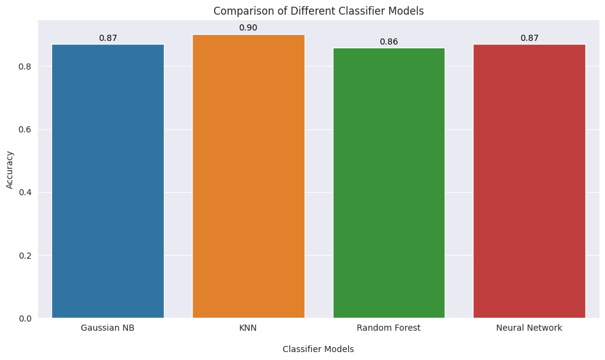

# Laporan Proyek Machine Learning - Elvaret

## Domain Proyek

Penyakit kardiovaskular (CVD) merupakan penyebab utama kematian secara global, merenggut sekitar 17,9 juta nyawa setiap tahunnya, yang menyumbang 31% dari total kematian di seluruh dunia [1]. Empat dari 5 kematian akibat CVD disebabkan oleh serangan jantung dan stroke, dan sepertiga dari kematian ini terjadi sebelum usia 70 tahun. Gagal jantung adalah peristiwa umum yang disebabkan oleh CVD. 

Berdasarkan riset yang telah dilakukan oleh beberapa Universitas Dunia, Dari 22.093 partisipan, sebanyak 6.455 (29,2%) memiliki risiko kardiovaskular tinggi, yang didefinisikan sebagai keberadaan penyakit jantung koroner, stroke, atau penyakit aterosklerosis lainnya; risiko penyakit kardiovaskular selama 10 tahun lebih dari atau sama dengan 30%; atau risiko penyakit kardiovaskular selama 10 tahun antara 10% hingga 29% yang dikombinasikan dengan tekanan darah sistolik di atas 140 mmHg. Prevalensi risiko penyakit kardiovaskular tinggi lebih tinggi di daerah perkotaan (31,6%, CI 30,7–32,5%) dibandingkan dengan daerah semi-perkotaan (28,7%, CI 27,3–30,1%) dan daerah pedesaan (26,2%, CI 25,2–27,2%). Hanya 11% dan 1% dari semua responden dengan risiko penyakit kardiovaskular tinggi yang menjalani pengobatan penurun tekanan darah dan statin, secara berturut-turut [2].

Berikut adalah beberapa contoh konkret penerapan model Machine Learning yang telah digunakan dalam bidang medis untuk mendukung diagnosis dan pengelolaan penyakit kardiovaskular:

1). Google AI dan Retinopathy Detection: Google AI telah mengembangkan model Machine Learning yang dapat mendeteksi tanda-tanda retinopati diabetik, yang dapat menjadi komplikasi serius dari diabetes yang juga berpotensi mempengaruhi kesehatan kardiovaskular. Model ini menganalisis gambar mata pasien dan mengidentifikasi tingkat keparahan retinopati, yang dapat membantu dalam pengenalan dini risiko penyakit kardiovaskular [3].

2). AliveCor's KardiaMobile: Perangkat seluler ini menggunakan Machine Learning untuk menganalisis sinyal EKG pasien dan mendeteksi gangguan irama jantung, termasuk fibrilasi atrium. Jika terdeteksi kondisi yang mengkhawatirkan, perangkat ini memberi tahu pengguna dan profesional medis untuk intervensi lebih lanjut [4].

3). IBM Watson for Genomics: IBM Watson telah digunakan untuk menganalisis data genomik pasien dan mengidentifikasi varian genetik yang berkaitan dengan risiko penyakit kardiovaskular. Ini membantu dokter memahami faktor risiko genetik pasien dan merencanakan pengelolaan penyakit yang lebih terarah [5].

5). CardioInsight's ECVUE Mapping Vest: Vest ini menggabungkan pemetaan elektrofisiologi jantung dengan Machine Learning untuk menciptakan pemetaan 3D tentang bagaimana impuls listrik bergerak melalui jantung. Informasi ini membantu ahli jantung merencanakan prosedur ablasio yang lebih tepat untuk aritmia [6].

Orang yang menderita penyakit kardiovaskular atau yang berisiko tinggi terhadap penyakit kardiovaskular (akibat adanya satu atau lebih faktor risiko seperti hipertensi, diabetes, hiperlipidemia, atau penyakit yang sudah ada) memerlukan deteksi dan pengelolaan dini. Pengintegrasian informasi dari berbagai faktor risiko dan karakteristik pasien, model-machine learning membantu memberikan pandangan yang lebih holistik dan akurat terhadap kondisi kardiovaskular seseorang. Dengan demikian, upaya pencegahan, diagnosis, dan pengelolaan penyakit kardiovaskular dapat ditingkatkan secara signifikan, serta memberikan dampak positif dalam mengatasi beban penyakit yang mematikan ini di seluruh dunia.

## Business Understanding

#### 1). Problem Statements
- Bagaimana menggabungkan dan menganalisis beragam faktor seperti usia, jenis kelamin, jenis nyeri dada, tekanan darah istirahat, kadar kolesterol,  dan faktor lainnya dari dataset ini untuk membangun model prediktif yang akurat dalam mengidentifikasi risiko penyakit kardiovaskular?

- Bagaimana menginterpretasikan hubungan antara variabel-variabel seperti jenis kelamin, tekanan darah, dan detak jantung dengan kondisi penyakit jantung pada individu berdasarkan dataset yang ada?

- Bagaimana mengembangkan model prediktif yang efektif dalam mengklasifikasikan pasien berdasarkan risiko penyakit jantung, dan bagaimana penerapan model ini dapat membantu dalam pencegahan serta intervensi dini untuk mengurangi risiko penyakit kardiovaskular yang serius?

#### 2). Goals
- Pengembangan Model Prediktif: Penelitian ini bertujuan utama untuk merancang dan mengimplementasikan sebuah model prediktif yang dapat memanfaatkan informasi dari dataset untuk mengklasifikasikan pasien berdasarkan risiko penyakit jantung. Fokus utama adalah pada akurasi dan keandalan prediksi yang dihasilkan oleh model ini terhadap kemungkinan pasien mengalami penyakit kardiovaskular.

- Identifikasi Faktor-Faktor Berpengaruh: Selain itu, penelitian ini juga memiliki tujuan untuk mengidentifikasi faktor-faktor yang memiliki dampak paling signifikan dalam memprediksi risiko penyakit jantung. Melalui analisis mendalam terhadap dataset, diharapkan model yang dikembangkan dapat memberikan pemahaman yang lebih baik tentang variabel-variabel kunci yang dapat memberikan gambaran yang lebih akurat terkait risiko berdasarkan informasi medis.

- Implementasi dalam Praktik Medis: Lebih dari sekadar pengembangan model, penelitian ini memiliki tujuan praktis yang kuat. Hal ini mencakup penerapan nyata dari model prediktif ini dalam dunia medis. Dengan mengintegrasikan model ke dalam praktik klinis, tujuannya adalah memberikan kontribusi yang berarti dalam mendukung praktisi kesehatan dalam mendeteksi risiko penyakit jantung pada pasien secara lebih efektif. Dengan informasi yang akurat dan cepat dari model ini, langkah-langkah pencegahan yang sesuai dapat diambil dengan lebih tepat dan cepat, membantu mengurangi dampak penyakit kardiovaskular yang serius.

#### 3). Solution statements
- *Model Gaussian Naive Bayes (GNB)*: Model GNB akan diterapkan untuk mengklasifikasikan pasien berdasarkan risiko penyakit jantung. Model ini akan dilatih menggunakan fitur-fitur numerik seperti usia, tekanan darah istirahat, kadar kolesterol, dan detak jantung maksimum. Evaluasi model akan melibatkan *metrik akurasi, presisi, recall, dan F1-score* untuk mengukur performanya dalam mengidentifikasi risiko penyakit jantung.

- *Model K-Nearest Neighbors (KNN)*: Model KNN akan digunakan untuk mengklasifikasikan pasien berdasarkan kesamaan fitur-fitur mereka dengan pasien lain dalam dataset. Berbagai nilai K akan dievaluasi untuk memilih nilai optimal yang menghasilkan kinerja terbaik. Evaluasi model akan melibatkan *metrik akurasi, presisi, recall, dan F1-score*.

- *Model Random Forest*: Model Random Forest yang lebih kompleks akan diterapkan untuk mengatasi ketergantungan dan interaksi antar fitur. Tuning akan dilakukan pada jumlah pohon, kedalaman pohon, dan fitur yang digunakan dalam setiap pohon. Evaluasi model akan menggunakan *metrik akurasi, presisi, recall, dan F1-score*.

- Pendekatan Neural Network (NN) dengan lapisan Dense: Jaringan saraf tiruan (neural network) akan diimplementasikan dengan lapisan-lapisan Dense untuk memprediksi risiko penyakit jantung. Eksperimen dengan berbagai arsitektur jaringan, jumlah lapisan, dan unit dalam setiap lapisan akan dilakukan. Pendekatan Random Search juga akan digunakan untuk mencari hyperparameter yang optimal secara otomatis. Evaluasi model akan melibatkan *metrik akurasi, presisi, recall, dan F1-score*.

Dalam penelitian ini, akan dibandingkan kinerja keempat model ini dengan menggunakan akurasi dan confusion matrix dalam memilih model yang paling optimal dalam mengklasifikasikan risiko penyakit jantung. Pendekatan ini akan memberikan gambaran yang lebih komprehensif tentang bagaimana model-model tersebut berkinerja dalam berbagai aspek evaluasi. Selain itu, dilakukan juga perbandingan antara akurasi pada data uji (test) dan data pelatihan (train) untuk mengidentifikasi kemungkinan adanya overfitting pada model. Hal ini penting karena perbandingan tersebut akan membantu untuk memahami apakah model cenderung terlalu cocok dengan data pelatihan, namun tidak dapat digeneralisasi dengan baik pada data yang belum pernah dilihat sebelumnya.

## Data Understanding
Dataset ini dibuat dengan menggabungkan beberapa dataset yang sebelumnya tersedia secara independen, namun belum pernah digabungkan sebelumnya. Dalam dataset ini, lima dataset terkait penyakit jantung digabungkan menjadi satu menggunakan 11 fitur umum, menjadikannya dataset penyakit jantung cukup optimal untuk tujuan penelitian. Kelima dataset yang digunakan dalam penggabungan ini adalah:

- Cleveland: 303 observasi
- Hungarian: 294 observasi
- Switzerland: 123 observasi
- Long Beach VA: 200 observasi
- Stalog (Heart) Data Set: 270 observasi
-- Total: 1190 observasi
-- Duplikasi: 272 observasi
-- Dataset akhir: 918 observasi

 Contoh: [Kaggle Dataset](https://www.kaggle.com/datasets/fedesoriano/heart-failure-prediction).

### Variabel-variabel pada Heart Failure Prediction dataset adalah sebagai berikut:
- Age (Usia): Usia pasien [tahun]
- Sex (Jenis Kelamin): Jenis kelamin pasien [L: Laki-laki, P: Perempuan]
- ChestPainType (Tipe Nyeri Dada): Jenis nyeri dada [TA: Typical Angina, ATA: Atypical Angina, NAP: Non-Anginal Pain, ASY: Asymptomatic]
- RestingBP (Tekanan Darah Istirahat): Tekanan darah istirahat [mm Hg]
- Cholesterol (Kolesterol): Kolesterol serum [mm/dl]
- FastingBS (Gula Darah Puasa): Gula darah puasa [1: jika FastingBS > 120 mg/dl, 0: sebaliknya]
- RestingECG (Elektrokardiogram Istirahat): Hasil elektrokardiogram istirahat [Normal: Normal, ST: memiliki kelainan gelombang ST-T (inversi gelombang T dan/atau elevasi atau depresi ST > 0,05 mV), LVH: menunjukkan hipertrofi ventrikel kiri yang mungkin atau pasti berdasarkan kriteria Estes]
- MaxHR (Detak Jantung Maksimal): Detak jantung maksimal yang dicapai [Nilai numerik antara 60 dan 202]
- ExerciseAngina (Angina Setelah Olahraga): Angina yang dipicu oleh olahraga [Y: Ya, N: Tidak]
- Oldpeak: Depresi ST [Nilai numerik yang diukur dalam depresi]
- ST_Slope (Slope ST Puncak Latihan): Kemiringan segmen ST puncak latihan [Up: naik, Flat: datar, Down: turun]
- HeartDisease (Penyakit Jantung): Kelas keluaran [1: penyakit jantung, 0: Normal]

**Exploratory Data Analysis**:
- Describe: .describe() juga dimanfaatkan untuk mendapatkan statistik deskriptif seperti rata-rata, median, dan deviasi standar dari tiap atribut.

- Info: Melalui .info(), informasi terkait jenis data dan adanya nilai yang tidak lengkap pada tiap atribut dapat dilihat. Analisis ini membantu pemahaman apakah perlu dilakukan pemrosesan lebih lanjut pada data yang kurang lengkap.

- Histogram: Metode .hist digunakan untuk menghasilkan histogram dari setiap atribut numerik dalam dataset. Ini memberikan wawasan tentang distribusi data serta potensi anomali atau tren khusus.

Terdapat 2 kolom yang perlu diselidiki:
a). Kolesterol adalah zat lemak yang ditemukan dalam tubuh manusia dan memiliki nilai yang berbeda-beda. Tidak mungkin bagi seseorang untuk memiliki nilai kolesterol yang tepat 0 dalam kondisi normal. 
b). Nilai RestingBP seseorang tidak mungkin bernilai 0 karena tekanan darah minimal yang dibutuhkan untuk memompa darah ke seluruh tubuh adalah 60 mmHg. Namun, nilai RestingBP seseorang bisa bernilai sangat rendah dan di bawah normal seperti 90/60 mmHg atau bahkan lebih rendah.

- Violin Plot dan Box Plot: Pendekatan visual seperti violin plot dan box plot diterapkan untuk menginterpretasikan distribusi dan variasi atribut numerik dalam relasinya dengan variabel target. Informasi ini membantu dalam mengidentifikasi pola atau perbedaan distribusi di antara kelas target yang berbeda.

Violin plot ini menunjukkan semakin tinggi nilai kolesterol, semakin tinggi juga risiko seseorang mengalami penyakit jantung. Ini berarti individu dengan kolesterol yang lebih tinggi cenderung memiliki kemungkinan lebih besar untuk mengalami penyakit jantung. 

- Count Plot: Count plot berguna untuk menghitung frekuensi kategori pada atribut kategorikal seperti jenis kelamin atau tipe nyeri dada. Analisis ini mengungkap sebaran kategori dan keseimbangan kelas dalam dataset.

Visualisasi di sebelah kiri menggambarkan pembagian total antara pria (biru) dan perempuan (hijau) dalam dataset. Sementara itu, visualisasi di sebelah kanan mengilustrasikan perbandingan antara pria dan perempuan yang menderita penyakit jantung dan yang tidak. Berdasarkan visualisasi ini juga, terdapat indikasi imbalanced class antar jenis kelamin dan perempuan

- Heatmap Correlation: Matriks korelasi dan heatmap diciptakan untuk memvisualisasikan korelasi antara atribut numerik. Langkah ini memfasilitasi identifikasi hubungan linier antara atribut-atribut tersebut.

Koefisien korelasi berkisar antara -1 dan +1. Ia mengukur kekuatan hubungan antara dua variabel serta arahnya (positif atau negatif). Mengenai kekuatan hubungan antar variabel, semakin dekat nilainya ke 1 atau -1, korelasinya semakin kuat. Sedangkan, semakin dekat nilainya ke 0, korelasinya semakin lemah. Arah korelasi antara dua variabel bisa bernilai positif (nilai kedua variabel cenderung meningkat bersama-sama) maupun negatif (nilai salah satu variabel cenderung meningkat ketika nilai variabel lainnya menurun). Pada visualisasi tersebut, *MaxHR dan Oldpeak* adalah fitur yang memiliki korelasi terbesar dengan fitur target *(HeartDisease)*

## Data Preparation
- Penanganan Missing Value dengan KNNImputer: Metode KNNImputer diterapkan untuk mengatasi nilai yang hilang dalam dataset. Dalam pendekatan ini, nilai yang hilang digantikan oleh nilai yang diestimasi berdasarkan tetangga terdekat dalam ruang fitur.  Saat membangun model prediksi, seperti klasifikasi, adanya nilai yang hilang dapat menyebabkan model tidak akurat atau bahkan gagal berfungsi. 

- One-Hot Encoding melalui pd.get_dummies(): Proses one-hot encoding dilakukan pada atribut-atribut kategorikal dalam dataset, seperti 'Sex', 'ChestPainType', 'RestingECG', 'ExerciseAngina', dan 'ST_Slope'. Pendekatan ini mengubah atribut kategorikal menjadi sejumlah kolom biner. Sebagai contoh, atribut 'Sex' dengan kategori 'M' dan 'F' diubah menjadi dua kolom baru ('Sex_M' dan 'Sex_F') yang berisi nilai 0 atau 1. Atribut kategorikal memerlukan representasi numerik agar dapat dimasukkan ke dalam algoritma pembelajaran mesin. One-hot encoding digunakan untuk menghindari asumsi tentang urutan atau relasi ordinal antara kategori, sehingga model tidak mengartikan urutan yang tidak ada.

- Teknik Oversampling: Pada kasus ini, dapat dilakukan *oversampling* pada kelas minoritas (data perempuan)  untuk menciptakan keseimbangan antara kelas-kelas tersebut. Ini dapat dilakukan dengan menggandakan data minoritas. Teknik ini juga dapat berlaku pada kolom categorical lainnya yang memiliki ketidakseimbangan kelas. Dalam konteks klasifikasi, ketidakseimbangan kelas dapat menyebabkan masalah dalam pelatihan model, di mana model cenderung cenderung mengabaikan kelas minoritas dan menghasilkan kinerja yang buruk pada kelas tersebut.

- Pembagian Data Train dan Test melalui sklearn.model_selection.train_test_split: Dataset dipisah menjadi data latih (train) dan data uji (test). Hal ini penting untuk menguji performa model pada data yang belum pernah terlihat sebelumnya. Proporsi data yang diuji dapat dikontrol melalui parameter split (0.1). Memisahkan dataset menjadi data latih dan uji memungkinkan evaluasi model pada data yang tak dikenal. Ini mencegah overfitting pada data latih dan membantu generalisasi model pada data baru.

- Standardisasi dengan sklearn.preprocessing.StandardScaler: StandardScaler digunakan untuk meratakan atribut numerik dalam dataset dengan mean 0 dan deviasi standar 1. Hal ini bermanfaat untuk algoritma yang sensitif terhadap skala, seperti k-nearest neighbors. Skala yang seimbang membantu model berfungsi baik dan stabil.Beberapa algoritma, seperti k-nearest neighbors dan regresi linier, peka terhadap skala atribut. Standardisasi memastikan atribut numerik memiliki skala serupa, meningkatkan performa dan stabilitas model.

Note:
Penerapan PCA dihindari karena beberapa fitur tidak menunjukkan korelasi yang tinggi terhadap target atau variasi yang signifikan dalam arah tertentu. Dalam situasi ini, PCA mungkin tidak memberikan manfaat yang signifikan. PCA lebih efektif ketika fitur-fitur memiliki variasi dan korelasi yang tinggi, sehingga dapat mengidentifikasi arah utama variasi dalam data. Oleh karena itu, langkah ini dilewati untuk beralih ke tahap berikutnya.

## Modeling
1). Gaussian Naive Bayes (GNB)
- Algoritma: Gaussian Naive Bayes
- Metrik Evaluasi: Akurasi
- Parameter: Tidak ada parameter yang diubah pada kode (menggunakan parameter default yang ditetapkan pustaka Scikit-learn).
- Hasil: Menghitung akurasi pada data latihan.
- Kelebihan: GNB adalah model probabilistik sederhana yang memiliki asumsi independensi antar atribut. Karena jumlah fitur lebih sedikit, asumsi independensi ini mungkin tidak terlalu merugikan kinerja model.
- Kekurangan: Asumsi independensi bisa menjadi keterbatasan jika ada keterkaitan yang signifikan antar atribut.

2). K-Nearest Neighbors (KNN)
- Algoritma: K-Nearest Neighbors
- Metrik Evaluasi: Akurasi
- Parameter: n_neighbors=10 (jumlah tetangga terdekat)
- Hasil: Menghitung akurasi pada data latihan.
- Kelebihan: KNN adalah metode berbasis instance yang memanfaatkan jarak antar data untuk klasifikasi. Karena dataset memiliki jumlah kolom yang relatif sedikit dan jumlah observasi yang lebih besar, KNN mungkin dapat memanfaatkan informasi yang tersedia secara efektif. Model ini dapat mengambil keuntungan dari relatifnya kompleksitas dan dimensi dataset.
- Kekurangan: KNN rentan terhadap data yang memiliki banyak fitur atau dimensi, dan juga sensitif terhadap skala fitur. Namun, jika dataset telah diolah dengan baik, KNN dapat bekerja dengan baik.

3). Random Forest (RF)
- Algoritma: Random Forest
- Metrik Evaluasi: Akurasi
- Parameter: n_estimators=50 (jumlah pohon), max_depth=16 (kedalaman maksimum)
- Hasil: Menghitung akurasi pada data latihan
- Kelebihan: Random Forest adalah ensemble learning yang berbasis pohon keputusan. Ini bisa baik untuk klasifikasi, terutama pada dataset dengan fitur yang lebih banyak. Namun, jumlah fitur yang relatif lebih sedikit mungkin membuat kompleksitas pohon-pohon dalam ensemble kurang mendapatkan keuntungan dari diversitas.
- Kekurangan: Jika dimensi fitur lebih sedikit dan kompleksitas model tidak sepenuhnya diperlukan, model lain seperti KNN yang lebih sederhana dapat memberikan hasil yang baik.

4). Pendekatan Neural Network
- Algoritma: Neural Network dengan Keras
- Metrik Evaluasi: Akurasi
- Parameter: neurons=[128, 256] (jumlah neuron dalam lapisan Dense)
- Tune Parameter: Random Search adalah sebuah metode untuk melakukan penelusuran (search) pada ruang hyperparameter dalam rangka menemukan kombinasi hyperparameter yang baik untuk model machine learning. Ini adalah salah satu teknik yang digunakan untuk mengoptimasi performa model dengan mencari kombinasi hyperparameter yang memberikan hasil terbaik.
- Hasil: Melakukan pencarian acak untuk jumlah neuron terbaik dan menghitung akurasi menggunakan validasi silang.
- Kelebihan: Neural Network adalah model yang mampu memodelkan hubungan yang kompleks antara fitur dan dapat memodelkan hubungan non-linear.
- Kekurangan: Dalam konteks dataset yang relatif lebih kecil, potensi overfitting bisa menjadi masalah. Maka dari itu, pendekatan ini memerlukan dataset yang besar dan tuning yang cermat pada arsitektur dan hyperparameter.

**Karakteristik Dataset yang Mempengaruhi Performa Model-Model**:
- Jumlah Fitur: Model yang lebih kompleks seperti Neural Network atau Random Forest cocok untuk dataset dengan banyak fitur, sementara model yang lebih sederhana seperti GNB lebih cocok untuk dataset dengan fitur yang lebih sedikit.
- Jumlah Observasi: KNN dapat bekerja lebih baik dengan dataset berjumlah observasi besar, sementara model seperti Neural Network dapat mengalami overfitting jika dataset terlalu kecil.
- Kompleksitas: Model seperti Neural Network mampu menangkap hubungan yang kompleks dan non-linear dalam data, sehingga cocok untuk dataset dengan karakteristik ini.
- Hubungan Fitur: Jika atribut dalam dataset relatif independen, GNB dapat memberikan performa yang baik. Namun, jika terdapat ketergantungan yang signifikan antara atribut, model-model lain yang mampu menangkap ketergantungan ini (seperti Neural Network) mungkin lebih cocok.

## Evaluation
Metrik evaluasi yang digunakan adalah Confusion matrix. Confusion matrix merupakan tabel yang digunakan dalam masalah klasifikasi untuk menggambarkan kinerja model dengan membandingkan prediksi model dengan nilai sebenarnya. Matriks ini memiliki empat sel: True Positive (TP), False Negative (FN), False Positive (FP), dan True Negative (TN).
- Accuracy: Akurasi mengukur sejauh mana model dapat mengklasifikasikan data dengan benar dari seluruh data yang ada. Ini adalah perbandingan antara jumlah prediksi yang benar dengan total data.
Berikut adalah formulanya:
$$Akurasi = (TP + TN) / (TP + TN + FP + FN)$$

- Precision: Precision (presisi) mengukur sejauh mana prediksi positif yang dilakukan oleh model adalah benar. Dalam konteks ini, presisi menghitung berapa persen dari pasien yang diprediksi menderita penyakit jantung, benar-benar menderita penyakit jantung.
Berikut adalah formulanya:
$$Presisi = TP / (TP + FP)$$

- Recall: Recall (sensitivitas) mengukur sejauh mana model dapat menemukan semua kasus positif yang sebenarnya. Dalam konteks ini, recall mengukur berapa persen pasien yang sebenarnya menderita penyakit jantung yang berhasil diidentifikasi oleh model.
Berikut adalah formulanya:
$$Recall = TP / (TP + FN)$$

- F1 Score: F1 score adalah rata-rata harmonik antara precision dan recall. Ini memberikan keseimbangan antara presisi dan recall. F1 score berguna ketika kelas target tidak seimbang dalam distribusinya.
Berikut adalah formulanya:
$$F1-Score = 2 * (Presisi * Recall) / (Presisi + Recall)$$

**Hasil Proyek berdasarkan Matrik Evaluasi**
1). Gaussian Naive Bayes (GNB):

a). Model GNB memiliki akurasi sebesar 0.87, yang berarti 87% dari seluruh prediksi yang dibuat adalah benar.
b). Precision adalah 0.84, yang menunjukkan bahwa dari pasien yang diprediksi menderita penyakit jantung, 84% di antaranya benar-benar menderita.
c). Recall adalah 0.94, yang berarti model berhasil mengidentifikasi 94% dari pasien yang sebenarnya menderita penyakit jantung.
d). F1 Score adalah 0.89, yang merupakan rata-rata harmonik antara precision dan recall.

2). K-Nearest Neighbors (KNN):

a). Model KNN memiliki akurasi sebesar 0.90, yang berarti 90% dari seluruh prediksi yang dibuat adalah benar.
b). Precision adalah 0.89, yang menunjukkan bahwa dari pasien yang diprediksi menderita penyakit jantung, 89% di antaranya benar-benar menderita.
c). Recall adalah 0.94, yang berarti model berhasil mengidentifikasi 94% dari pasien yang sebenarnya menderita penyakit jantung.
d). F1 Score adalah 0.91, yang merupakan rata-rata harmonik antara precision dan recall.

3). Random Forest:

a). Model Random Forest memiliki akurasi sebesar 0.86, yang berarti 86% dari seluruh prediksi yang dibuat adalah benar.
b). Precision adalah 0.82, yang menunjukkan bahwa dari pasien yang diprediksi menderita penyakit jantung, 82% di antaranya benar-benar menderita.
c). Recall adalah 0.94, yang berarti model berhasil mengidentifikasi 94% dari pasien yang sebenarnya menderita penyakit jantung.
d). F1 Score adalah 0.88, yang merupakan rata-rata harmonik antara precision dan recall.

4). Pendekatan Neural Network (NN):

a). Model Pendekatan NN memiliki akurasi sebesar 86.96%, yang berarti 86.96% dari seluruh prediksi yang dibuat adalah benar.
b). Precision adalah 0.839, yang menunjukkan bahwa dari pasien yang diprediksi menderita penyakit jantung, 83.9% di antaranya benar-benar menderita.
c). Recall adalah 0.94, yang berarti model berhasil mengidentifikasi 94% dari pasien yang sebenarnya menderita penyakit jantung.
d). F1 Score adalah 0.887, yang merupakan rata-rata harmonik antara precision dan recall.

**Model Terbaik**:

Berdasarkan hasil evaluasi, model terbaik adalah **K-Nearest Neighbors (KNN)** dengan akurasi sebesar 0.90. Meskipun pendekatan Neural Network memiliki akurasi yang baik (0.87), namun dataset yang digunakan relatif kecil (918 observasi). Oleh karena itu, KNN yang menghasilkan akurasi yang tinggi dan lebih stabil dipilih sebagai model terbaik dalam mengklasifikasikan risiko penyakit jantung.

KNN mungkin lebih baik dalam kasus ini karena sederhananya algoritma, kemampuannya mengambil keuntungan dari dataset yang lebih besar, dan karakteristik dataset yang memiliki jumlah fitur yang lebih sedikit. Dalam konteks dataset ini, KNN dapat memberikan keseimbangan antara kompleksitas model dan ukuran dataset.

**Note**: Perbandingan antara tingkat kejadian (Occurrence Rate) dengan Value ditampilkan melalui penggunaan fungsi sns.distplot(). Pada plot ini, distribusi nilai aktual (diwakili oleh warna merah) dan nilai yang diprediksi (diwakili oleh warna biru) dari model yang telah dibuat akan disajikan. Visualisasi ini memberikan pemahaman tentang bagaimana distribusi data aktual dan prediksi terhadap nilai-nilai tertentu, khususnya dalam  kasus klasifikasi penyakit jantung (0 atau 1).

### Kesimpulan
Proyek ini berfokus pada pengembangan model Machine Learning untuk mengidentifikasi risiko penyakit kardiovaskular dengan menggunakan dataset yang menggabungkan informasi dari beberapa studi sebelumnya. Tujuannya adalah untuk menghasilkan model prediktif yang akurat dalam mengklasifikasikan pasien berdasarkan risiko penyakit jantung. Berbagai model ML telah diuji, termasuk Gaussian Naive Bayes, K-Nearest Neighbors (KNN), Random Forest, dan pendekatan Neural Network. Evaluasi dilakukan dengan metrik akurasi, precision, recall, dan F1-score.

Hasil evaluasi menunjukkan bahwa model terbaik adalah KNN, dengan akurasi 90%, dan model ini dipilih karena kemampuannya yang baik dalam mengklasifikasikan risiko penyakit jantung dengan dataset yang relatif kecil. Meskipun pendekatan Neural Network juga memberikan hasil yang baik, KNN dipilih sebagai model yang lebih stabil dalam konteks dataset ini. Dengan model ini, diharapkan dapat membantu praktisi kesehatan dalam mendeteksi risiko penyakit jantung pada pasien secara lebih efektif.

### Saran
Beberapa saran praktis tentang bagaimana hasil proyek ini bisa digunakan oleh profesional medis untuk meningkatkan deteksi dan pengelolaan penyakit kardiovaskular:

- Pengembangan Alat Bantu Keputusan: Hasil dari proyek Machine Learning ini dapat diintegrasikan ke dalam sistem alat bantu keputusan medis. Ini akan memungkinkan dokter untuk memasukkan data pasien dan menerima rekomendasi berdasarkan analisis model. Misalnya, alat bantu keputusan dapat memberikan informasi tentang risiko penyakit kardiovaskular berdasarkan faktor-faktor tertentu seperti usia, riwayat kesehatan, dan profil biokimia.

- Pemantauan Pasien: Model yang telah dikembangkan dapat digunakan untuk pemantauan pasien jangka panjang. Dengan mengumpulkan data berkala dari pasien, profesional medis dapat melacak perubahan dalam risiko penyakit kardiovaskular dan mengambil tindakan pencegahan yang sesuai.

- Perencanaan Riset Lanjutan: Temuan dari proyek ini dapat membuka peluang untuk penelitian medis lebih lanjut. Profesional medis dapat menggunakan wawasan dari model untuk merancang studi lebih mendalam tentang faktor-faktor yang berkontribusi terhadap risiko penyakit kardiovaskular.

#### Referensi 
[1]	A. D. Saragih, “TERAPI DISLIPIDEMIA UNTUK MENCEGAH RESIKO PENYAKIT JANTUNG KORONER.” [Online]. Available: http://jurnal.globalhealthsciencegroup.com/index.php/IJNHS

[2]	A. Maharani, Sujarwoto, D. Praveen, D. Oceandy, G. Tampubolon, and A. Patel, “Cardiovascular disease risk factor prevalence and estimated 10-year cardiovascular risk scores in Indonesia: The SMARThealth Extend study,” PLoS One, vol. 14, no. 4, Apr. 2019, doi: 10.1371/journal.pone.0215219.

[3]	V. Bellemo et al., “Artificial Intelligence Screening for Diabetic Retinopathy: the Real-World Emerging Application,” Current Diabetes Reports, vol. 19, no. 9. Current Medicine Group LLC 1, Sep. 01, 2019. doi: 10.1007/s11892-019-1189-3.

[4]	I. L. Goldenthal et al., “Recurrent atrial fibrillation/flutter detection after ablation or cardioversion using the AliveCor KardiaMobile device: iHEART results,” J Cardiovasc Electrophysiol, vol. 30, no. 11, pp. 2220–2228, Nov. 2019, doi: 10.1111/jce.14160.

[5]	Y. Chen, E. Argentinis, and G. Weber, “IBM Watson: How Cognitive Computing Can Be Applied to Big Data Challenges in Life Sciences Research,” Clinical Therapeutics, vol. 38, no. 4. Excerpta Medica Inc., pp. 688–701, Apr. 01, 2016. doi: 10.1016/j.clinthera.2015.12.001.

[6]	G. Cheniti et al., “Non-invasive Mapping and ECGI in Atrial and Ventricular Arrhythmias (CardioInsight),” 2019.